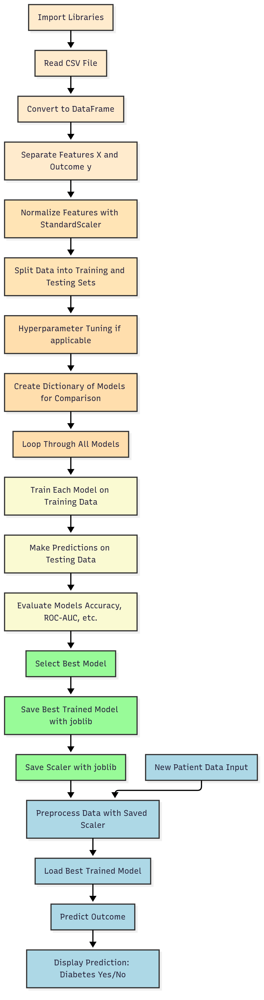

Here’s the updated, complete README.md file incorporating all the details you just shared:

# Diabetes Prediction - Machine Learning Project


This project is an **interactive Diabetes Prediction System** that uses multiple machine learning models to predict whether a patient has diabetes based on clinical features. It includes **model comparison, hyperparameter tuning, and deployment** using **Streamlit**.

---

## Table of Contents
- [Project Overview](#project-overview)
- [Dataset](#dataset)
- [Workflow](#workflow)
- [Machine Learning Models](#machine-learning-models)
- [Hyperparameter Tuning](#hyperparameter-tuning)
- [Streamlit Dashboard](#streamlit-dashboard)
- [Installation](#installation)
- [How to Run](#how-to-run)
- [Project Structure](#project-structure)
- [Results](#results)
- [Future Improvements](#future-improvements)
- [Author](#author)

---

## Project Overview
The goal of this project is to predict diabetes in patients using health-related data such as glucose level, BMI, blood pressure, insulin, age, and other features.  

**Highlights:**
- Compare multiple ML models to select the best-performing one.
- Train models on historical data and evaluate using unseen test data.
- Save the trained model and scaler for real-time predictions.
- Deploy a user-friendly interactive dashboard with **Streamlit**.

---

## Dataset
- **Source:** [Pima Indians Diabetes Dataset](https://www.kaggle.com/uciml/pima-indians-diabetes-database)
- **Features:**
  - Pregnancies
  - Glucose
  - Blood Pressure
  - Skin Thickness
  - Insulin
  - BMI
  - Diabetes Pedigree Function
  - Age
- **Target Variable:** `Outcome` (0 = No Diabetes, 1 = Diabetes)

---

## Workflow

### Steps:
1. **Import Libraries** – pandas, numpy, seaborn, matplotlib, scikit-learn, xgboost, Streamlit, joblib
2. **Load Dataset** – read CSV and convert to DataFrame.
3. **Separate Features and Target** – `X` = all input features, `y` = Outcome.
4. **Scale Features** – normalize data using `StandardScaler`.
5. **Split Dataset** – into training (80%) and testing (20%) sets.
6. **Hyperparameter Tuning** – optimize Random Forest and Gradient Boosting models.
7. **Train All Models** – logistic regression, decision tree, random forest, SVM, KNN, gradient boosting, XGBoost.
8. **Evaluate Models** – calculate accuracy and ROC-AUC.
9. **Select Best Model** – based on performance metrics.
10. **Save Model and Scaler** – using joblib.
11. **Streamlit App** – input form, prediction, and visualization.

### Workflow Diagram
The workflow of the Diabetes Prediction Project is illustrated below:




---

## Machine Learning Models
- Logistic Regression  
- Decision Tree  
- Random Forest (**with hyperparameter tuning**)  
- Support Vector Machine (SVM)  
- K-Nearest Neighbors (KNN)  
- Gradient Boosting (**with hyperparameter tuning**)  
- XGBoost  

**Performance Metrics:** Accuracy & ROC-AUC  

---

## Hyperparameter Tuning

### Random Forest
- `n_estimators`: [100, 200]  
- `max_depth`: [4, 6, None]  
- `min_samples_split`: [2, 5]  
- `min_samples_leaf`: [1, 2]  

### Gradient Boosting
- `n_estimators`: [100, 200]  
- `learning_rate`: [0.01, 0.05, 0.1]  
- `max_depth`: [3, 4, 5]  

---

## Streamlit Dashboard

**Features:**
- Enter patient health data through a simple UI.
- View predictions instantly.
- Compare model performances with Accuracy and ROC-AUC.
- Visualize confusion matrix of the best-performing model.

**Example Screenshot:**  
<!-- replace with actual screenshot -->


Or access the **live demo here**: [Diabetes Prediction App](https://diabetes-mellitus-project-bnz5anrpsnlumh4tlxhvg3.streamlit.app/)

---

## Installation
1. Clone the repository:
```bash
git clone https://github.com/Debbatisudheer/Diabetes-mellitus-project.git


Navigate to project folder:

cd Diabetes-mellitus-project


Create a virtual environment:

python3 -m venv venv
source venv/bin/activate   # Mac/Linux
venv\Scripts\activate      # Windows


Install dependencies:

pip install -r requirements.txt

How to Run
streamlit run app.py


Input patient details.

Click Predict.

See Diabetes Yes/No prediction.

Compare ML model performance.

Project Structure
Diabetes-mellitus-project/
│
├── app.py                   # Main Streamlit app
├── diabetes.csv             # Dataset
├── best_diabetes_model.pkl  # Saved best model
├── scaler.pkl               # Saved scaler
├── requirements.txt         # Project dependencies
├── README.md                # Documentation

Results
Model	Accuracy	ROC-AUC
Logistic Regression	71.43%	0.82
Decision Tree	72.08%	0.67
Random Forest	75.97%	0.81
SVM	74.68%	0.79
KNN	70.78%	0.75
Gradient Boosting	75.32%	0.84
XGBoost	73.38%	0.81

Best Model: Random Forest

Future Improvements

Include data balancing techniques (SMOTE) for better performance.

Add hyperparameter tuning for all models.

Enhance Streamlit app UI/UX.

Add logging and exception handling for production deployment.
